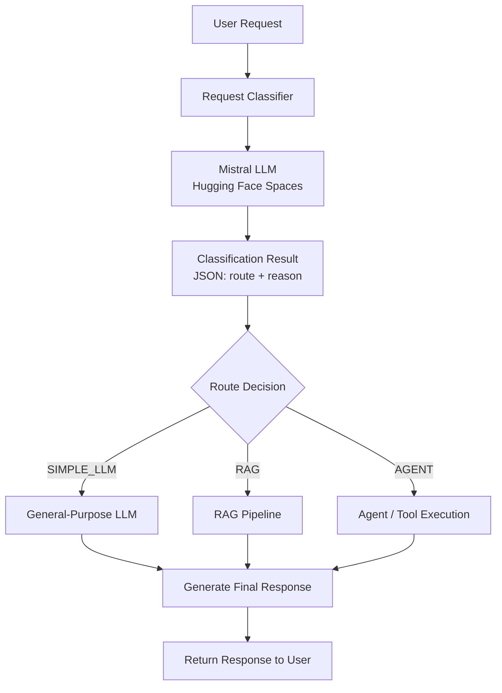

## Architecture

```mermaid
flowchart TD
    A["User Request"] --> B["Request Classifier"]

    B --> C["Mistral LLM<br/>Hugging Face Spaces"]
    C --> D["Classification Result<br/>JSON: route + reason"]

    D --> E{"Route Decision"}

    E -->|SIMPLE_LLM| F["General-Purpose LLM"]
    E -->|RAG| G["RAG Pipeline"]
    E -->|AGENT| H["Agent / Tool Execution"]

    F --> I["Generate Final Response"]
    G --> I
    H --> I

    I --> J["Return Response to User"]
```
