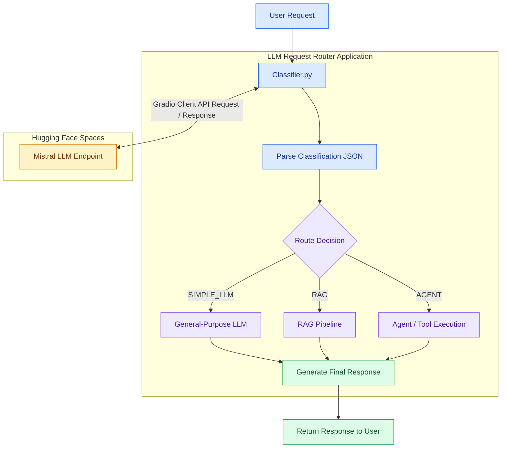

## Architecture

```mermaid
flowchart TD
    A["User Request"] --> B["Classifier.py"]

    subgraph APP["LLM Request Router Application"]
        B --> D["Parse Classification JSON"]
        D --> E{"Route Decision"}

        E -->|SIMPLE_LLM| F["General-Purpose LLM"]
        E -->|RAG| G["RAG Pipeline"]
        E -->|AGENT| H["Agent / Tool Execution"]

        F --> I["Generate Final Response"]
        G --> I
        H --> I
    end

    subgraph HF["Hugging Face Spaces"]
        C["Mistral LLM Endpoint"]
    end

    B <-->|"Gradio Client API Request / Response"| C

    I --> J["Return Response to User"]

    classDef app fill:#dbeafe,stroke:#2563eb,color:#1e3a8a
    classDef hf fill:#fef3c7,stroke:#d97706,color:#78350f
    classDef routing fill:#ede9fe,stroke:#7c3aed,color:#4c1d95
    classDef output fill:#dcfce7,stroke:#16a34a,color:#14532d

    class A,B,D app
    class C hf
    class E,F,G,H routing
    class I,J output
```
